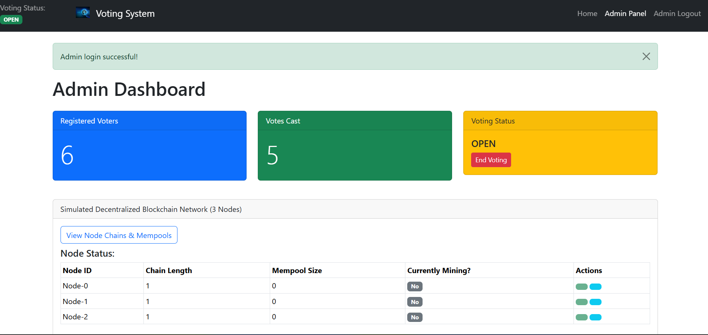
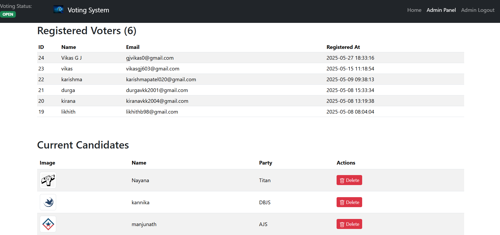

# 🗳️ Flask Voting System

A secure, email-verified voting platform built using Python Flask and SQLite. Designed for small organizations or academic use, this system enables voter registration, secure authentication, QR-code-based ballot distribution, and vote counting — all through a simple web interface.

---

## 🚀 Features

- 🔐 Admin authentication with hashed passwords
- 📧 OTP-based email verification for voters
- 🧾 QR code generation for secure vote access
- 📊 Live vote submission and result display
- 🗂 File upload support (e.g., ID proofs)
- 🛡️ Environment-based config for secrets & credentials

---

## 🛠️ Tech Stack

- **Backend**: Python 3, Flask
- **Database**: SQLite (local `voting.db`)
- **Auth & Email**: Flask-Login, Flask-Mail
- **Frontend**: HTML, CSS (Bootstrap), JavaScript
- **Others**: `qrcode`, `dotenv`

---






## 🧪 Local Setup

### 1. Clone the Repository

```bash
git clone https://github.com/vikasgj/Voting-System.git
cd Voting-System
